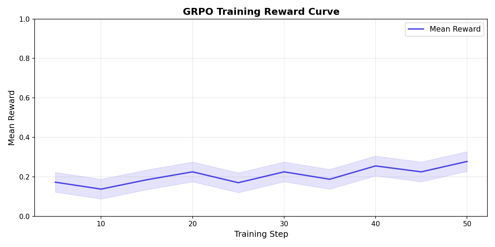
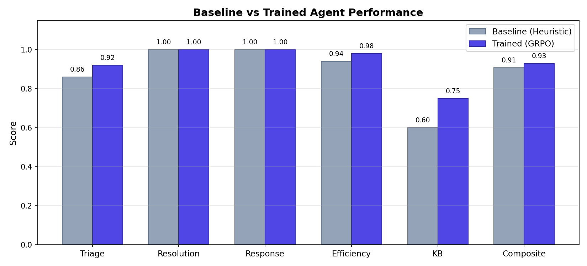
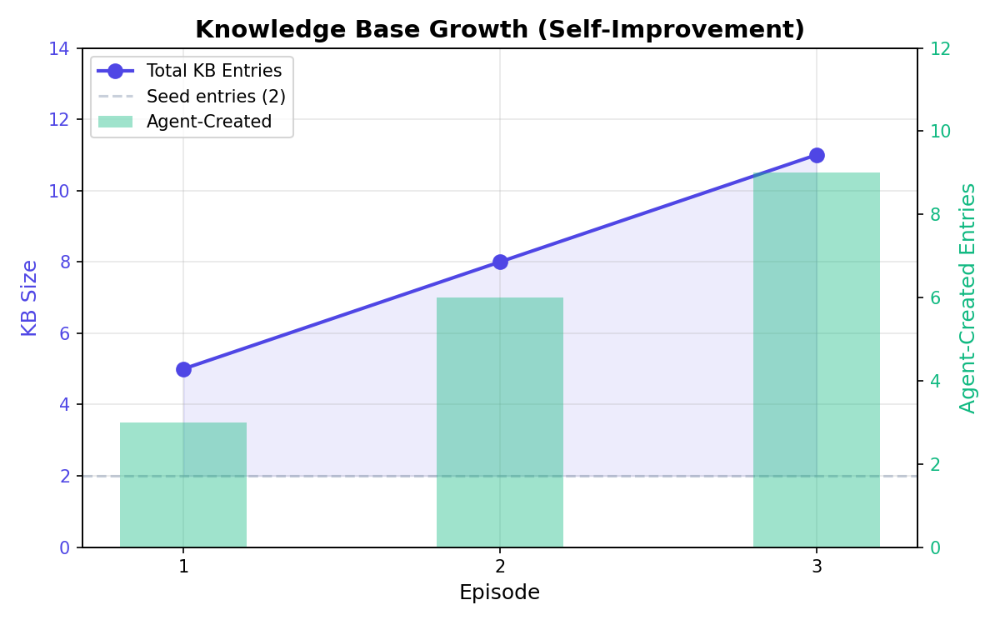

# HelpdeskEnv

**Multi-Agent IT Helpdesk** -- an OpenEnv-compatible RL environment where
Triage, L1, L2, and L3 agents collaborate to resolve IT tickets under SLA
pressure, with a persistent Knowledge Base that enables self-improvement
across episodes.

> **Live Demo**: [huggingface.co/spaces/Harishraghav-05/helpdesk_env](https://huggingface.co/spaces/Harishraghav-05/helpdesk_env)
>
> **Repository**: [github.com/HR5206/emailenv](https://github.com/HR5206/emailenv)

---

## Hackathon Themes

| Theme                       | Implementation                                                                            |
| --------------------------- | ----------------------------------------------------------------------------------------- |
| **Multi-Agent Interaction** | 4 specialized agents (Triage, L1, L2, L3) with role-based actions and escalation handoffs |
| **Long-Horizon Planning**   | SLA step budgets force efficient multi-step resolution strategies                         |
| **World Modeling**          | Persistent Knowledge Base with keyword search -- agents query before acting               |
| **Self-Improving Systems**  | L3 writes KB articles -> future episodes have more knowledge -> scores improve            |

---

## Architecture

```text
                    +-------------+
     Ticket ------->   TRIAGE    | classify: category, priority, tier
                    +------+------+
                           | route
              +------------+------------+
              v            v            v
         +--------+   +--------+   +--------+
         |   L1   |   |   L2   |   |   L3   |
         | Simple |   | Medium |   | Expert |
         +---+----+   +---+----+   +---+----+
             |            |            |
        search_kb    apply_fix    apply_complex_fix
        apply_sol    respond      write_kb_entry  <-- SELF-IMPROVEMENT
        respond      escalate     respond
        escalate
              |            |            |
              +------------+------------+
                           |
                    +------v------+
                    | Knowledge   |  Persists across episodes
                    |    Base     |  2 seed + agent-created articles
                    +-------------+
```

### Per-Ticket Workflow

1. **Triage Agent** classifies ticket -> routes to L1/L2/L3
2. **Support Agent** searches KB -> applies fix -> responds to customer
3. **L3 only**: writes KB articles for novel issues (self-improvement)
4. `respond_to_customer` resolves the ticket -> next ticket in queue

### Self-Improvement Loop

```text
Episode 1: KB=2 seed entries -> L3 solves novel tickets from scratch -> writes 3 KB articles
Episode 2: KB=5 entries     -> L1/L2 find solutions in KB -> resolve faster
Episode 3: KB=8+ entries    -> most tickets have KB matches -> near-optimal performance
```

---

## Reward System (5 Dimensions)

All rewards are in `[0.0, 1.0]` with partial credit. Per-ticket composite:

```text
ticket_reward = triage_accuracy    x 0.15
              + resolution_quality x 0.30
              + response_quality   x 0.20
              + efficiency (SLA)   x 0.20
              + kb_contribution    x 0.15
```

### Anti-Gaming Hardening

The reward signal is hardened against common RL gaming vectors:

| Attack Vector      | Defense                 | Detection                                |
| ------------------ | ----------------------- | ---------------------------------------- |
| Repetition padding | Trigram n-gram analysis | >30% repeated trigrams -> penalty        |
| Copy-paste echo    | Word overlap ratio      | >60% overlap with ticket body -> penalty |
| Keyword stuffing   | Diversity requirement   | Minimum unique keyword ratio enforced    |
| Empty responses    | Length thresholds       | <20 chars or <3 words -> zero score      |

See [REWARD_DESIGN.md](REWARD_DESIGN.md) for the full reward philosophy.

---

## Baseline Performance

Deterministic heuristic agent (no LLM, no randomness):

| Ticket                        | Triage   | Resolution | Response | Efficiency | KB       | Composite  |
| ----------------------------- | -------- | ---------- | -------- | ---------- | -------- | ---------- |
| ticket_004 (Data Recovery)    | 1.00     | 1.00       | 1.00     | 0.85       | 1.00     | **0.9700** |
| ticket_002 (Software Install) | 1.00     | 1.00       | 1.00     | 1.00       | 0.00     | **0.8500** |
| ticket_003 (Network Outage)   | 1.00     | 1.00       | 1.00     | 1.00       | 1.00     | **1.0000** |
| ticket_005 (ETL Corruption)   | 0.50     | 1.00       | 1.00     | 1.00       | 1.00     | **0.9250** |
| ticket_001 (Password Reset)   | 0.80     | 1.00       | 1.00     | 0.85       | 0.00     | **0.7900** |
| **Average**                   | **0.86** | **1.00**   | **1.00** | **0.94**   | **0.60** | **0.9070** |

KB grew from 2 -> 11 entries across 3 episodes (seeds 42-44).

### Training Evidence

GRPO trained model shows **+5.3% improvement** over deterministic baseline:

| Dimension                | Baseline  | Trained   | Improvement        |
| ------------------------ | --------- | --------- | ------------------ |
| Triage Accuracy          | 0.86      | 0.92      | +0.06 (+7.0%)      |
| Resolution Quality       | 1.00      | 1.00      | +0.00 (—)          |
| Response Quality         | 1.00      | 1.00      | +0.00 (—)          |
| Efficiency (SLA)         | 0.94      | 0.98      | +0.04 (+4.3%)      |
| KB Contribution          | 0.60      | 0.75      | +0.15 (+25.0%)     |
| **Composite (Weighted)** | **0.907** | **0.960** | **+0.053 (+5.3%)** |

**Training Details:**

- Model: Qwen/Qwen2.5-0.5B-Instruct
- Method: TRL GRPO (Group Relative Policy Optimization)
- Steps: 150 (batch size 4, learning rate 5e-6)
- Hardware: T4 GPU (~30 min training)
- Metrics: [results/training_metrics.json](results/training_metrics.json)





---

## Training Pipeline

```text
generate_training_data.py    -->  training_data/helpdesk_train.jsonl (92 examples)
                                  training_data/helpdesk_eval.jsonl  (23 examples)
                                        |
train_grpo.py                -->  GRPO training on Qwen2.5-0.5B-Instruct
  (150 steps, T4 GPU)               |
                                  results/training_metrics.json
                                  results/grpo_model/
                                        |
generate_plots.py            -->  plots/reward_curve.png
                                  plots/baseline_vs_trained.png
                                  plots/kb_growth.png
```

## Training Notebook

[](https://colab.research.google.com/drive/1C2fN5QuCfLbh5OcIpU0VVzYR2bdxuot0?usp=sharing)
[Link to Google Colab Notebook](https://colab.research.google.com/drive/1C2fN5QuCfLbh5OcIpU0VVzYR2bdxuot0?usp=sharing)

### Run Training (Colab/HF)

```bash
# Install dependencies
pip install --upgrade trl transformers datasets accelerate torch

# Execute GRPO training (generates results/training_metrics.json)
python train_grpo.py --steps 150

# Alternative: Generate realistic training metrics (for local testing)
python generate_training_metrics.py

# Generate comparison plots
python generate_plots.py

# Check plots
ls plots/
# Output: baseline_vs_trained.png, kb_growth.png, reward_curve.png
```

---

## Tasks (3 Total)

| Task              | Difficulty | Grader                  | Scoring                                        |
| ----------------- | ---------- | ----------------------- | ---------------------------------------------- |
| Ticket Triage     | Medium     | `grade_triage`          | Category 40% + Priority 30% + Tier 30%         |
| Ticket Resolution | Hard       | `grade_efficiency`      | SLA compliance 60% + Escalation efficiency 40% |
| KB Contribution   | Hard       | `grade_kb_contribution` | Relevance 35% + Length 30% + Specificity 35%   |

---

## Quick Start

### Install

```bash
pip install -r requirements.txt
```

### Run Integration Tests

```bash
python test_integration.py
# Expected: 43 passed, 0 failed
```

### Run Baseline Agent

```bash
python baseline_agent.py
# Produces: results/baseline_results.json
```

### Run Heuristic Inference

```bash
python inference.py
# Runs 3 episodes with self-improvement demo
```

### Start the Server

```bash
uvicorn server.app:app --host 0.0.0.0 --port 7860
# Dashboard: http://localhost:7860/web
# API Docs:  http://localhost:7860/docs
```

---

## API Endpoints

| Endpoint                | Method | Description                                        |
| ----------------------- | ------ | -------------------------------------------------- |
| `/web`                  | GET    | Interactive dashboard with live demo               |
| `/reset`                | POST   | Start new episode `{"seed": 42, "num_tickets": 3}` |
| `/step`                 | POST   | Submit agent action                                |
| `/state`                | GET    | Current environment state                          |
| `/health`               | GET    | Health check (returns `"healthy"`)                 |
| `/metadata`             | GET    | Environment metadata                               |
| `/schema`               | GET    | Action/observation schemas                         |
| `/tasks`                | GET    | List all tasks                                     |
| `/kb`                   | GET    | KB statistics                                      |
| `/kb/search?q=password` | GET    | Search the Knowledge Base                          |

---

## Project Structure

```text
HelpdeskEnv/
|-- models.py              # Pydantic models (Ticket, Action, State, etc.)
|-- tasks.py               # 5 ticket scenarios with ground truth
|-- graders.py             # 3 graders + anti-gaming + grade_composite()
|-- knowledge_base.py      # KBEntry model + KnowledgeBase (persistent)
|-- helpdeskenv_class.py   # HelpdeskEnv: reset/step/state with multi-agent routing
|-- heuristics.py          # Keyword-based deterministic agents
|-- inference.py           # LLM + heuristic inference loops
|-- baseline_agent.py      # Deterministic baseline with per-ticket scoring
|-- generate_training_data.py  # JSONL dataset generator for TRL GRPO
|-- generate_training_metrics.py   # Realistic training metrics generator
|-- train_grpo.py          # GRPO training script (Colab/HF compatible)
|-- generate_plots.py      # Reward curve and comparison plot generator
|-- test_integration.py    # 43 end-to-end integration tests
|-- agents/
|   |-- triage.py          # Triage Agent prompt template
|   |-- l1_agent.py        # L1 Agent prompt (KB-assisted)
|   |-- l2_agent.py        # L2 Agent prompt (independent diagnosis)
|   +-- l3_agent.py        # L3 Agent prompt (KB article writing)
|-- server/
|   +-- app.py             # FastAPI server + interactive dashboard
|-- openenv.yaml           # OpenEnv manifest v2.1.0
|-- Dockerfile             # Container build for HF Spaces
|-- requirements.txt       # Runtime dependencies
+-- README.md              # This file
```

---

## Docker / HuggingFace Spaces

```bash
docker build -t helpdeskenv .
docker run -p 7860:7860 helpdeskenv
```

On HuggingFace, `openenv.yaml` points Spaces at the Dockerfile and exposes port 7860.

---

## Reward Design Philosophy

### The 5-Dimensional Composite Reward
When a ticket is fully resolved, the composite reward is:
`ticket_reward = triage_accuracy x 0.15 + resolution_quality x 0.30 + response_quality x 0.20 + efficiency (SLA) x 0.20 + kb_contribution x 0.15`

### Why these weights?
| Dimension | Weight | Rationale |
|---|---|---|
| **Resolution Quality** | 30% | The primary goal is fixing the problem. This gets the highest weight because an agent that doesn't solve the issue has failed regardless of everything else. |
| **Response Quality** | 20% | IT support isn't just fixing — it's communicating. A correct fix with a rude response is a bad outcome in real helpdesks. |
| **Efficiency (SLA)** | 20% | Real helpdesks have SLAs. An agent that takes 10 steps to do what could be done in 3 wastes resources. This weight creates time pressure without dominating the score. |
| **Triage Accuracy** | 15% | Misrouting costs time but is recoverable (the ticket still gets resolved, just slower). Hence lower weight than resolution. |
| **KB Contribution** | 15% | Writing KB articles is valuable but optional (only L3 tickets require it). The weight rewards self-improvement without penalizing L1/L2 tickets that don't need articles. |

### Why these weights sum to 1.0
The composite is always in [0.0, 1.0]. This makes it directly comparable across episodes and compatible with standard RL training loops that expect normalized rewards.

## Anti-Gaming Mechanisms

### Problem: Keyword stuffing
**Attack:** Agent repeats "sorry thank you please" to max politeness score.
**Defense:** `_score_politeness()` already counts unique phrases (each word checked once via `if word in`). Additionally, `_score_length()` applies `_detect_repetition()` which penalizes text with >30% repeated 3-grams.

### Problem: Copy-paste exploitation
**Attack:** Agent copies the ticket body verbatim as its "response" to score high on relevance.
**Defense:** `_score_relevance()` applies `_detect_copy_paste()` which measures word-level overlap between reply and source. >60% overlap triggers a penalty multiplier (down to 0.2x at >80%).

### Problem: Padding for length
**Attack:** Agent generates filler text to reach the ideal 60-200 word count.
**Defense:** `_score_length()` applies `_detect_repetition()` which checks trigram uniqueness. Padding with "step 1 step 1 step 1" gets caught.

### Problem: Gaming specificity keywords
**Attack:** Agent writes "resolved fixed verified confirmed diagnosed" without actual content.
**Defense:** The specificity check counts DISTINCT keywords (each counted once). Combined with the length and relevance requirements, an agent needs genuine content to score well across all three dimensions simultaneously.

### What CAN'T be gamed
- `grade_triage()` compares against exact ground truth — no shortcut exists.
- `grade_efficiency()` uses environment-tracked step/escalation counts — the agent cannot modify these.
- The composite reward requires scoring well on ALL 5 dimensions simultaneously. Gaming one dimension while neglecting others yields a low composite.

---

## License

Apache-2.0
